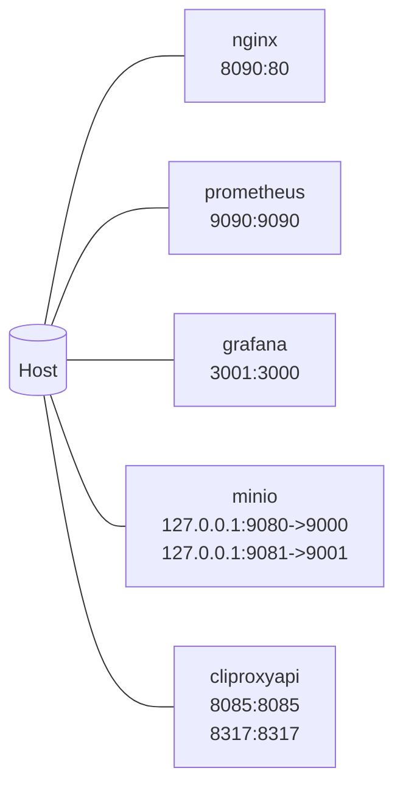
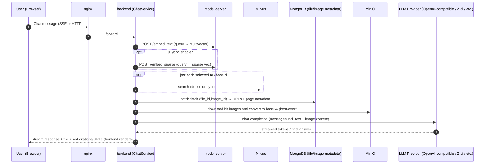
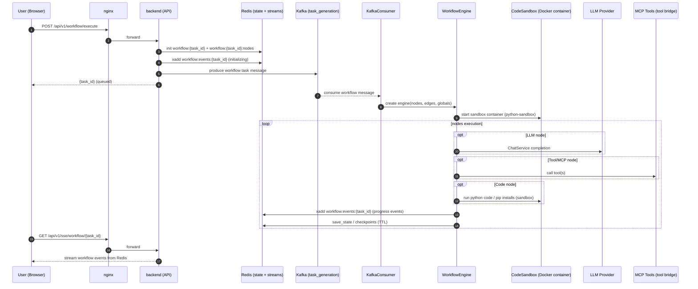

# System Diagrams (LAYRA) — Mermaid

**Scope:** `/LAB/@thesis/layra`  
**Updated:** 2026-02-04  

This document provides “maximum effort” Mermaid diagrams for the main project links (“maillons”):

- **Runtime topology** (Docker Compose services, exposed ports)
- **Ingestion pipeline** (upload → images → embeddings → Milvus)
- **RAG query path** (query → embeddings → hybrid search → LLM)
- **Evaluation loop** (dataset → retrieval → metrics)
- **Workflow engine execution** (queue → sandbox → events/SSE)

Canonical code+repo mapping lives in `docs/REPO_MAP.md`.

---

## 1) System Context (what talks to what)

```mermaid
flowchart LR
  %% === Users ===
  user[User / Browser]

  %% === Edge ===
  nginx[nginx\n:8090 (host)]
  frontend[frontend\nNext.js]
  backend[backend\nFastAPI]

  user -->|HTTP| nginx
  nginx --> frontend
  nginx --> backend

  %% === Core RAG services ===
  modelserver[model-server\nEmbeddings (dense+sparse)]
  milvus[milvus-standalone\nVector DB]
  milvus_etcd[milvus-etcd]
  milvus_minio[milvus-minio\n(Milvus internal)]

  backend --> modelserver
  backend --> milvus
  milvus --> milvus_etcd
  milvus --> milvus_minio

  %% === State / metadata stores ===
  mysql[(mysql)]
  mongodb[(mongodb)]
  redis[(redis)]
  minio[(minio\nUser object storage)]
  kafka[(kafka)]

  backend --> mysql
  backend --> mongodb
  backend --> redis
  backend --> minio
  backend --> kafka

  %% === Conversion & sandbox ===
  unoserver[unoserver\nDocument conversion]
  sandbox[python-sandbox\nIsolated code exec]
  backend --> unoserver
  backend --> sandbox

  %% === Observability ===
  prometheus[prometheus\n:9090 (host)]
  grafana[grafana\n:3001 (host)]
  prometheus --> grafana

  %% === Optional external APIs ===
  jina[Jina Embeddings API\n(optional)]
  llm[LLM Provider(s)\n(Z.ai / OpenAI-compatible / etc.)]

  backend -.->|optional: embed_text/embed_image| jina
  backend -.->|chat completions| llm

  %% === Optional proxy ===
  cliproxy[cliproxyapi\n:8085/:8317 (host)]
  backend -.->|optional: proxy| cliproxy
  cliproxy -.-> llm
```

Evidence pointers:
- Compose: `docker-compose.yml`
- Backend entrypoint: `backend/app/main.py`
- RAG retrieval path: `backend/app/core/llm/chat_service.py`
- Embedding calls: `backend/app/rag/get_embedding.py`
- Upload/ingest: `backend/app/api/endpoints/chat.py`, `backend/app/rag/utils.py`

---

## 2) Docker Compose Runtime (services + exposed ports)

### 2.1 Service inventory (from `docker-compose.yml`)

Services (19 total): `backend`, `cliproxyapi`, `frontend`, `grafana`, `kafka`, `kafka-init`,
`milvus-etcd`, `milvus-minio`, `milvus-standalone`, `minio`, `model-server`,
`model-weights-init`, `mongodb`, `mysql`, `nginx`, `prometheus`, `python-sandbox`, `redis`,
`unoserver`.

### 2.2 Exposed ports (host bindings)



Notes:
- Many services are internal-only on the `layra-net` network.
- `kafka-init` and `model-weights-init` are init jobs.

---

## 3) Ingestion Pipeline (Upload → Milvus)

This is the critical path when a user uploads a PDF/Doc via the chat UI.

Key code:
- Upload endpoint: `backend/app/api/endpoints/chat.py` (`/upload/{username}/{conversation_id}`)
- Queue consumer: `backend/app/utils/kafka_consumer.py`
- File processing: `backend/app/rag/utils.py::process_file`
- Conversion: `backend/app/rag/convert_file.py::convert_file_to_images`
- Embeddings: `backend/app/rag/get_embedding.py::get_embeddings_from_httpx`
- Milvus insert: `backend/app/rag/utils.py::insert_to_milvus`

```mermaid
sequenceDiagram
  autonumber
  participant U as User (Browser)
  participant N as nginx
  participant F as frontend (Next.js)
  participant B as backend (FastAPI)
  participant O as MinIO (user storage)
  participant R as Redis (task status)
  participant K as Kafka (task_generation)
  participant KC as KafkaConsumer (backend task)
  participant CV as Converter (pdf2image / unoserver)
  participant MS as model-server (embeddings)
  participant M as Milvus (vectors)
  participant MDB as MongoDB (metadata)

  U->>N: POST /api/v1/upload/{username}/{conversation_id}
  N->>B: forward request

  B->>R: init task:{task_id} (status=processing)
  loop for each uploaded file
    B->>O: upload original file (save_file_to_minio)
    B->>K: produce message (task_id, knowledge_db_id, file_meta)
  end
  B-->>U: 200 {task_id, knowledge_db_id, files[]}

  %% async consumer
  K-->>KC: consume file_processing message
  KC->>R: update task progress (processing...)

  KC->>O: download original file bytes
  KC->>CV: convert file -> images_buffer[]
  alt PDF
    CV-->>KC: pdf2image pages -> PNG buffers
  else DOC/DOCX/PPTX/etc
    CV->>CV: unoserver convert -> PDF
    CV-->>KC: pdf2image pages -> PNG buffers
  end

  loop batch pages (EMBED_BATCH_SIZE)
    KC->>MS: POST /embed_image (multivector embeddings)
    KC->>MS: POST /embed_sparse (page texts → sparse vectors)
    KC->>M: insert vectors (dense + sparse + metadata)
    KC->>O: upload per-page image PNG
    KC->>MDB: store image metadata (file_id, image_id, page_number, URLs)
  end

  KC->>MDB: store file metadata + attach file to KB
  KC->>R: processed += 1 ; set completed if all files done
```

Where data ends up (high level):
- **MinIO**: original file + per-page rendered images
- **Milvus**: vectors per page (dense + optional sparse)
- **MongoDB**: file + image metadata (URLs, page numbers, KB membership)
- **Redis**: task status/progress

---

## 4) RAG Query Path (Chat → Retrieval → LLM)

Key code:
- Main RAG block: `backend/app/core/llm/chat_service.py`
- Embeddings: `backend/app/rag/get_embedding.py`
- Hybrid search: `backend/app/db/milvus.py` (RRFRanker / WeightedRanker)
- Image hydration (MinIO→base64): `backend/app/rag/utils.py::replace_image_content`



Important behavior notes:
- Retrieval is **best-effort**: if embeddings/search fail, chat continues without RAG context.
- Some models (ex: DeepSeek) have image content stripped to avoid incompatibility (still answerable in text-only mode).

---

## 5) Evaluation Loop (dataset → retrieval → metrics)

Key code:
- Runner: `backend/app/eval/runner.py::run_evaluation`
- Metrics: `backend/app/eval/metrics.py`
- API: `backend/app/api/endpoints/eval.py`
- Dataset source: `backend/app/eval/dataset.py` + `backend/app/eval/config/`

```mermaid
flowchart TD
  api[Eval API\nPOST /api/v1/eval/run] --> runner[run_evaluation()]

  runner --> dataset[get_dataset(dataset_id)\n(MongoDB)]
  dataset -->|kb_id| collection[colqwen{kb_id}\n(Milvus collection)]

  runner --> embed[get_embeddings_from_httpx\n(embed_text)]
  embed --> search[vector_db_client.search\n(top_k)]
  search --> results[retrieved_docs + ranks + scores]

  results --> judge[Compare to ground truth labels]
  judge --> metrics[Compute MRR / nDCG@K / P@K / R@K]
  metrics --> agg[Aggregate + p95 latency]
  agg --> store[Store EvalRun in MongoDB]
```

What this measures:
- **Retrieval quality** (ranking correctness vs labels)
- **Latency distribution** (p95 ms)
- **Failure rate** (embedding/search errors)

---

## 6) Workflow Engine (queue → sandbox → events/SSE)

Key code:
- Workflow API: `backend/app/api/endpoints/workflow.py` (`POST /execute`)
- Queue & consumer: `backend/app/utils/kafka_consumer.py`
- Engine: `backend/app/workflow/workflow_engine.py`
- Sandbox: `backend/app/workflow/sandbox.py` (Docker-based execution)
- Events: Redis stream key `workflow:events:{task_id}`
- Streaming: `backend/app/api/endpoints/sse.py`



Operational notes:
- State is TTL-bound in Redis (default 1h in the API init code).
- Workflows can pause (breakpoints / input_resume) and then resume by re-queueing tasks.

---

## 7) Data Stores (what belongs where)

```mermaid
flowchart LR
  subgraph ObjectStorage[MinIO]
    orig[Original user files]
    imgs[Rendered page images]
  end

  subgraph VectorDB[Milvus]
    dense[Dense multivectors\n(ColQwen-style)]
    sparse[Sparse vectors\n(BGE-M3 tokens)]
  end

  subgraph Metadata[MongoDB]
    kb[Knowledge bases\n(files list)]
    files[Files (file_id)\nURLs, hashes]
    images[Images (image_id)\npage_number, URLs]
    evalruns[Eval datasets/runs]
  end

  subgraph State[Redis]
    tasks[task:{task_id}\nprogress/status]
    wfstate[workflow:{task_id}:state]
    wfevents[workflow:events:{task_id}\nstream]
    idemp[processed:{idempotency_key}]
  end

  subgraph Relational[MySQL]
    users[Users/auth\n+ relational records]
  end

  orig --> files
  imgs --> images
  dense -->|doc/page ids| images
  sparse -->|doc/page ids| images
  kb --> files
```

