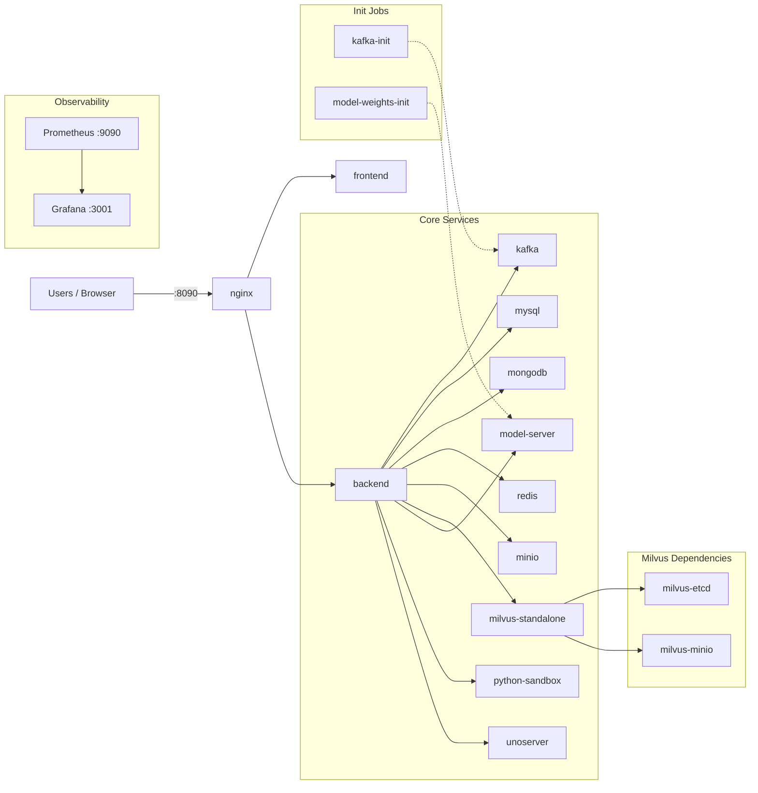

# Deployment Diagram (Minimal)

## Overview
- Single Docker Compose stack on `layra-net`.
- Only three ports are exposed to the host.

## Topology (Mermaid)

## Exposed Ports (Host)
- `8090` nginx (primary app entrypoint)
- `9090` Prometheus
- `3001` Grafana

## Notes
- All other services are internal to `layra-net`.
- `kafka-init` and `model-weights-init` are one-time init jobs.
