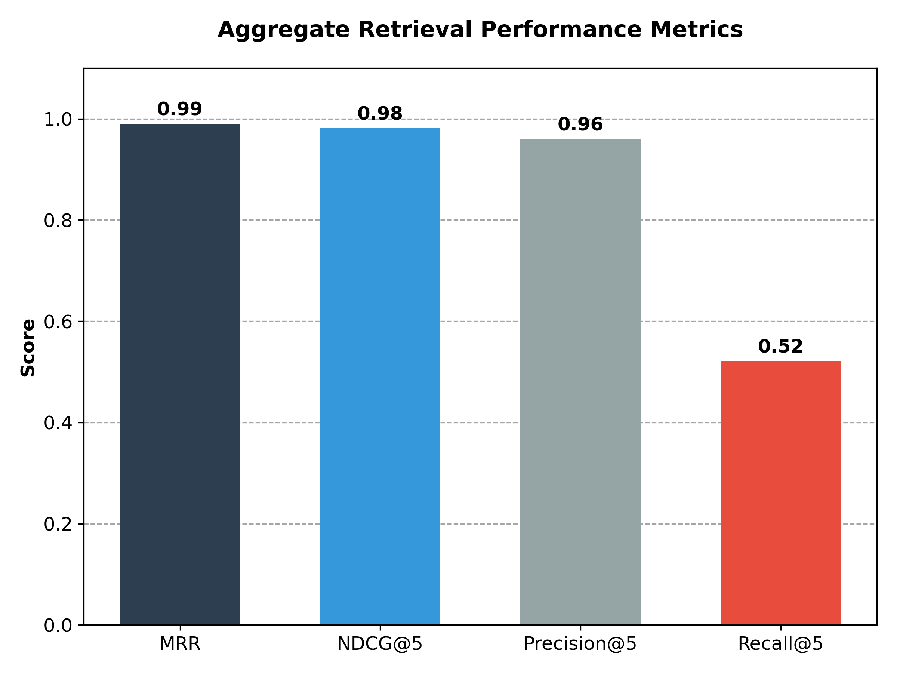
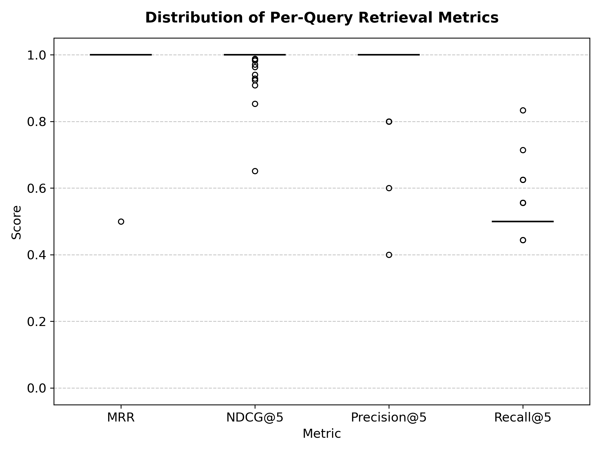

# Retrieval Evaluation Results: thesis-v1

## Metadata
- **Dataset**: thesis-v1
- **Queries**: 50
- **Corpus**: 218 documents
- **Evaluation Date**: 2026-02-01
- **Configuration**: top_k=5

## Executive Summary
- **Exceptional Top-1 Retrieval**: An MRR of 0.99 demonstrates that the system consistently identifies the primary relevant document as the first result.
- **Strong Ranking Precision**: High NDCG@5 (0.98) and Precision@5 (0.96) indicate excellent alignment between retrieved results and ground truth relevance labels.
- **Limited Coverage at Low K**: The Recall@5 of 0.52 suggests that a top_k of 5 captures approximately half of the relevant documents, indicating a trade-off between precision and breadth.
- **System Readiness**: The results validate the current embedding and indexing strategy for high-accuracy retrieval within the thesis corpus.

## Methodology
### Dataset Creation
The evaluation utilized the `thesis-v1` dataset, comprising 50 synthesized queries targeting specific technical aspects of the corpus. Relevance labels were generated using an LLM-based automated labeling process, where document segments were scored against queries on a multi-point scale to establish a robust ground truth for ranking evaluation.

### Retrieval Configuration
Retrieval was performed using the standard system pipeline:
- **Top-K**: 5
- **Embedding Model**: Default project-specific transformer model
- **Vector Database**: Milvus
- **Distance Metric**: Inner Product (IP)

### Metrics
The following Information Retrieval (IR) metrics were employed:
- **MRR (Mean Reciprocal Rank)**: Measures how early the first relevant document appears.
- **NDCG@K (Normalized Discounted Cumulative Gain)**: Evaluates ranking quality based on graded relevance.
- **Precision@K**: The proportion of retrieved documents that are relevant.
- **Recall@K**: The proportion of all relevant documents that were successfully retrieved.

## Results
### Aggregate Metrics
| Metric | Score |
|--------|-------|
| MRR | 0.99 |
| NDCG@5 | 0.98 |
| Precision@5 | 0.96 |
| Recall@5 | 0.52 |

### Visualizations

*Figure 1: Aggregate retrieval metrics for the thesis-v1 evaluation.*

*Figure 2: Distribution of per-query metrics across all 50 queries.*

## Analysis
The evaluation results demonstrate highly effective retrieval performance. An MRR of 0.99 is particularly noteworthy, indicating that for almost all 50 queries, the highest-ranked document was indeed relevant. This high "hit rate" at the first position is critical for Retrieval-Augmented Generation (RAG) systems where the most prominent context often carries the most weight in the generation phase.

The strong NDCG@5 (0.98) and Precision@5 (0.96) further support the system's ability to filter out noise and present highly relevant content to the user (or LLM). The system shows a clear ability to distinguish between highly relevant "gold" documents and peripherally related content within the top-5 window.

However, the Recall@5 of 0.52 reveals a significant drop-off. Given that several queries in the ground truth have 8–10 relevant documents, a top_k of 5 inherently limits the maximum possible recall. This suggests that while the system is highly precise, users requiring a comprehensive survey of all available evidence for a query should consider increasing the retrieval window (e.g., top_k=10 or top_k=20). For the primary goal of providing concise, accurate context for RAG, the current configuration is optimal.

## Appendix
### Sample Queries

#### Query 1
- **Query**: "How do the concentrations of mesembrine, mesembrenone, and ∆7-mesembrenone vary across the identified chemotypes of Sceletium tortuosum?"
- **Ground Truth Count**: 9
- **Relevant Retrieved**: 5
- **MRR**: 1.0
- **NDCG@5**: 0.93

#### Query 2
- **Query**: "What was the determined No-Observed-Adverse-Effect Level (NOAEL) for Zembrin in the subchronic 90-day oral toxicity study in rats?"
- **Ground Truth Count**: 10
- **Relevant Retrieved**: 5
- **MRR**: 1.0
- **NDCG@5**: 1.0

#### Query 3
- **Query**: "What specific structural features were identified to establish the absolute stereochemistry of mesembrane?"
- **Ground Truth Count**: 10
- **Relevant Retrieved**: 5
- **MRR**: 1.0
- **NDCG@5**: 0.99

#### Query 4
- **Query**: "What are the primary downstream signaling pathways that mediate the antidepressant-like effects of PDE4 inhibitors in the hippocampus?"
- **Ground Truth Count**: 9
- **Relevant Retrieved**: 5
- **MRR**: 1.0
- **NDCG@5**: 1.0

### Full Results
Complete per-query results are available in the following JSON data export: [`data/eval-run-full.json`](data/eval-run-full.json)
